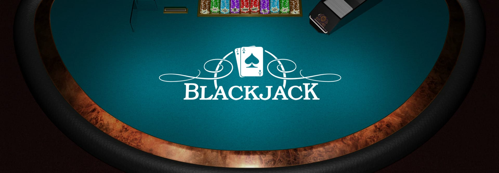

# Blackjack Trainer

I love card games, strategy, maths, and blackjack in particular, so I asked myself the question:
**can you actually beat the casino?**

This project is my attempt to answer that. I wanted to build two things at once: a proper
blackjack game where I could practice optimal strategy and card counting, and a simulator
that would let me run millions of hands to measure the real long-run edge of different
approaches - from flat-betting basic strategy all the way to Hi-Lo counting with
Illustrious 18 deviations.

The result is two independent applications built on the same Python game engine:

| | App | What it does |
|---|---|---|
| 🃏 | **Interactive Game** | Play blackjack in the browser with real-time hints, Hi-Lo counter, and strategy coaching |
| 📊 | **EV Lab** | Run Monte Carlo simulations and compute the expected value of any hand situation |

Both apps share the same mathematically rigorous rules engine. **Mathematical accuracy
takes absolute priority over everything else.**

---

## Project structure

```
├── app_simulation.py       # Streamlit EV Lab - entry point
├── start.sh                # One-command launcher for both apps
├── requirements.txt        # Python dependencies
├── .env.example            # Environment config (copy to .env)
│
├── simulation/             # Shared Python game engine
│   ├── engine.py           # Shoe, hand mechanics, all game actions
│   ├── strategy.py         # Complete basic strategy tables (Wizard of Odds)
│   ├── counting.py         # Hi-Lo running count + true count
│   ├── deviations.py       # Illustrious 18 index plays (Schlesinger)
│   ├── betting.py          # Bet ramp - spread to unit bet by true count
│   ├── simulator.py        # Monte Carlo loop
│   └── config.py           # Configuration dataclasses
│
├── tests/                  # 334 unit tests
│
├── react/
│   ├── blackjack.jsx       # Full game UI (single React file)
│   └── dist/               # Production build - open dist/index.html directly
│
└── docs/references/        # Strategy chart and I18 deviation table images
```

---

## Getting started

### Requirements

- **Python 3.11+**
- **Node.js 18+** and npm

### Install

```bash
git clone https://github.com/PaulSerin/Black-Jack-Trainer.git
cd Black-Jack-Trainer

# Python dependencies
pip install -r requirements.txt

# Node dependencies
cd react && npm install && cd ..
```

### Run

**Recommended - both apps at once (requires Git Bash or WSL on Windows):**

```bash
./start.sh
```

This starts both servers, shows you the URLs, and `Ctrl+C` shuts everything down cleanly.

**Manual - two separate terminals:**

```bash
# Terminal 1 - Interactive Game
cd react && npm run dev
# → http://localhost:5173

# Terminal 2 - EV Lab
streamlit run app_simulation.py
# → http://localhost:8501
```

### Optional - configure ports

Copy `.env.example` to `.env` to change the default ports or URLs:

```bash
cp .env.example .env
```

```env
VITE_PORT=5173                            # React dev server port
STREAMLIT_PORT=8501                       # Streamlit port
VITE_SIMULATOR_URL=http://localhost:8501  # "Simulator" button in the game
STREAMLIT_GAME_URL=http://localhost:5173  # "Open Game" button in Streamlit
```

---

## Table of Contents

- [Game Interface](#game-interface)
  - [The Table](#the-table)
  - [Card Counting - Hi-Lo](#card-counting--hi-lo)
  - [Betting System](#betting-system)
  - [Hints & Strategy Tables](#hints--strategy-tables)
  - [Game Settings](#game-settings)
- [Simulation Suite](#simulation-suite)
  - [Monte Carlo Simulator](#monte-carlo-simulator)
  - [EV Playground](#ev-playground)

---

## Game Interface

The game is a single-page React application reproducing a full casino blackjack experience.
It includes real-time Hi-Lo card counting, basic strategy hints, Illustrious 18 deviation
alerts, a chip-based betting system, and fully configurable table rules - all in one file,
no backend required.

---

### The Table

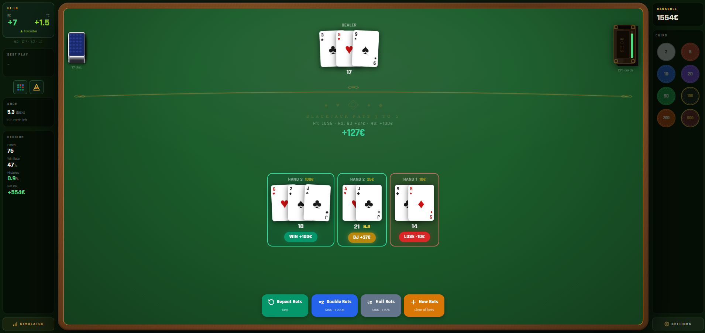

The table displays up to **6 simultaneous player hands** against the dealer. Each hand shows
its cards, total value, bet amount, and result badge (WIN / LOSE / BJ / PUSH / BUST) after
the round. The net result for the round is displayed in the center of the felt - green for
profit, red for loss.

After each round, four quick-action buttons appear at the bottom:

| Button | Action |
|---|---|
| **Repeat Bets** | Replay the exact same bets on all hands |
| **Double Bets** | Double all bets (capped by bankroll) |
| **Half Bets** | Halve all bets |
| **New Bets** | Clear all bets - place fresh ones |

This speeds up sessions significantly when grinding through hands.

---

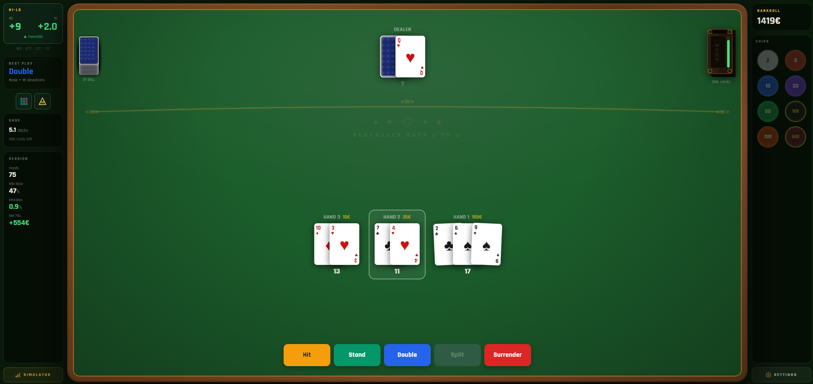

During play, the active hand is highlighted with a golden glow. The dealer's hole card
remains face down until all player hands are resolved. The hint panel (top-left) shows
the optimal action in real time - here **Double** at RC +9 / TC +2.0. Action buttons
(Hit / Stand / Double / Split / Surrender) are enabled or disabled based on the current
hand state and the configured table rules.

---

### Card Counting - Hi-Lo

The left sidebar provides a real-time Hi-Lo counting HUD.

**Hi-Lo system tag values:**

| Cards | Tag |
|---|---|
| 2 – 6 | +1 |
| 7 – 9 | 0 |
| 10, J, Q, K, A | −1 |

**Running Count (RC)** - updated after every card dealt, including the dealer's hole card
at reveal time.

**True Count (TC)** = RC ÷ decks remaining, rounded to the nearest 0.5. This normalizes
the raw count for the number of decks left in the shoe, making it comparable across different
shoe depths.

**Favorable / Unfavorable** badge - the shoe is considered favorable when TC ≥ +1 (more
high cards remaining, player has a statistical edge).

**Session statistics** are tracked continuously throughout the session:

| Stat | Description |
|---|---|
| Hands | Total hands played this session |
| Win Rate | Percentage of hands won |
| Mistakes | Percentage of decisions that deviated from optimal play (BS or I18) |
| Net P&L | Total profit or loss in € since session start |

The active table configuration is always visible below the Hi-Lo panel:
`6D · S17 · 3:2 · LS`

---

### Betting System

Before each round, place bets by clicking chips onto the betting spots directly on the felt.

**Multiple hands:** start with 1 spot. Use the **+** buttons on either side of the table to
add up to **6 simultaneous hands**. Each hand has an independent bet.

**Chips available:** 2 · 5 · 10 · 20 · 50 · 100 · 200 · 500 €

**Bankroll** is displayed in the top-right sidebar. Double-click to edit it at any time
(only available between rounds). Chips are automatically greyed out if their value exceeds
the remaining bankroll or the per-hand maximum bet.

---

### Hints & Strategy Tables

The **Best Play** panel in the left sidebar shows the optimal action for the current hand
in real time - updated on every decision, based on basic strategy and the current True Count.

The hint label indicates whether it comes from basic strategy or an Illustrious 18 deviation:

> *"Hit - Basic + 18 deviations"* ← standard basic strategy
> *"Stand - ★ TC dev (H)"* ← I18 deviation overrides basic strategy

Two reference overlays are accessible via icon buttons below the Best Play panel:

**Basic Strategy chart**
Full color-coded hard / soft / pair strategy table for the configured ruleset.
When opened during a hand, the current situation is automatically highlighted in the table.

**Illustrious 18 Deviations**
The 18 most valuable Hi-Lo index plays. For each entry: the situation, the basic strategy
play, the deviation play, the TC threshold, and the direction (≥ or ≤).
If a deviation applies to the current hand, its row is highlighted automatically.

---

### Game Settings

Click **Settings** (bottom of the right sidebar) to configure the table rules.
All changes take effect at the start of the next hand and update the strategy advisor instantly.

| Parameter | Default | Options |
|---|---|---|
| Blackjack payout | 3:2 | 3:2 / 6:5 |
| Dealer rule | S17 | S17 / H17 |
| Late Surrender | On | On / Off |
| Double Down | Any 2 cards | Any / 9–11 only / 10–11 only |
| Double After Split (DAS) | On | On / Off |
| Re-split | Up to 4 hands | 2 / 3 / 4 |
| Re-split Aces | Off | On / Off |
| Number of decks | 6 | 1 / 2 / 4 / 6 / 8 |
| Deck penetration | 75% | 50% → 90% |

---

## Simulation Suite

From the game, click **Simulator** at the bottom of the left sidebar to open the simulation
suite in a new browser tab.

The suite contains two independent tools:

- **Monte Carlo Simulator** - long-run session simulation with configurable strategy and
  bet spread, producing bankroll progression, TC analysis, and variance charts
- **EV Playground** - single-situation EV analysis with TC scanning and automatic crossover
  point detection

---

## Monte Carlo Simulator

### What is it?

The Monte Carlo Simulator plays millions of blackjack hands automatically to measure the
long-run **Expected Value (EV)** of a given strategy and bet spread.

**Expected Value (EV)** is the average profit or loss per hand expressed as a percentage of
the amount wagered. A player using perfect basic strategy in a standard 6-deck S17 game
faces approximately **−0.44% EV** - meaning they lose about €0.44 per €100 wagered on average.

A card counter using Hi-Lo with a bet spread can shift this edge to approximately
**+0.5% to +1.0%** by betting more when the True Count is positive (shoe rich in 10s and Aces,
favorable to the player) and less when it is negative.

**Bet spread** is the ratio between the minimum and maximum bet. A 1-8 spread means betting
1 unit at TC ≤ 0 and scaling up to 8 units at TC ≥ +4. A wider spread increases EV but also
increases variance and makes the counting pattern more visible to the casino.

---

### Configuration

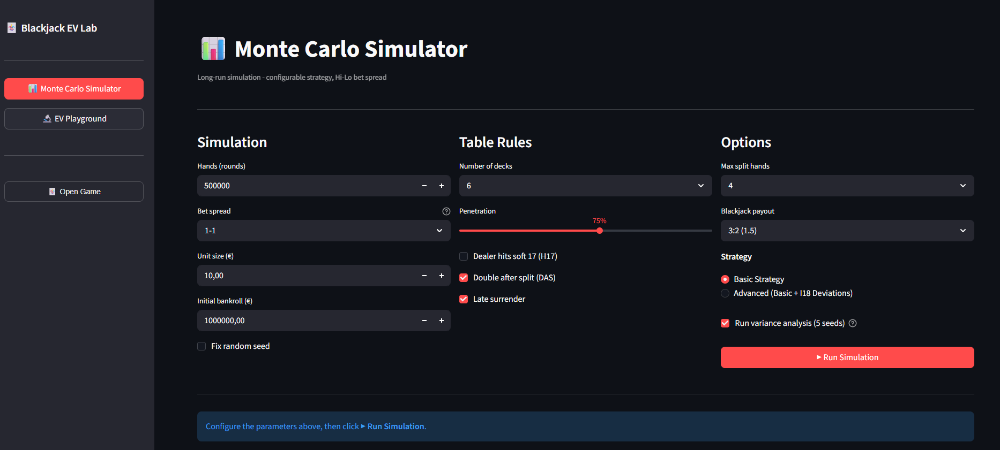

The simulator is configured across three sections:

**Simulation**
- Number of hands (up to 1,000,000)
- Bet spread: flat 1-1 up to 1-12
- Unit size in € (the minimum bet - the spread multiplies this)
- Initial bankroll
- Optional: fix a random seed for fully reproducible results

**Table Rules**
- Number of decks (1, 2, 4, 6, 8)
- Deck penetration (50% → 90%)
- Dealer H17 / S17
- Double After Split (DAS)
- Late Surrender

**Options**
- Max split hands
- Blackjack payout (3:2 or 6:5)
- Strategy: Basic Strategy only, or **Advanced** (Basic Strategy + Illustrious 18 Deviations)
- **Run variance analysis (5 seeds)** - runs 5 independent simulations with different random
  seeds and overlays all curves on a single chart to visualize natural variance

A simulation of 500,000 hands typically completes in approximately 30 seconds, 1,000,000 in about 60 seconds.

---

### Example - Advanced strategy, 1,000,000 hands

Configuration: 6 decks · S17 · DAS · Late Surrender · 3:2 · bankroll €1,000,000

---

**Key Metrics & Bankroll Progression**

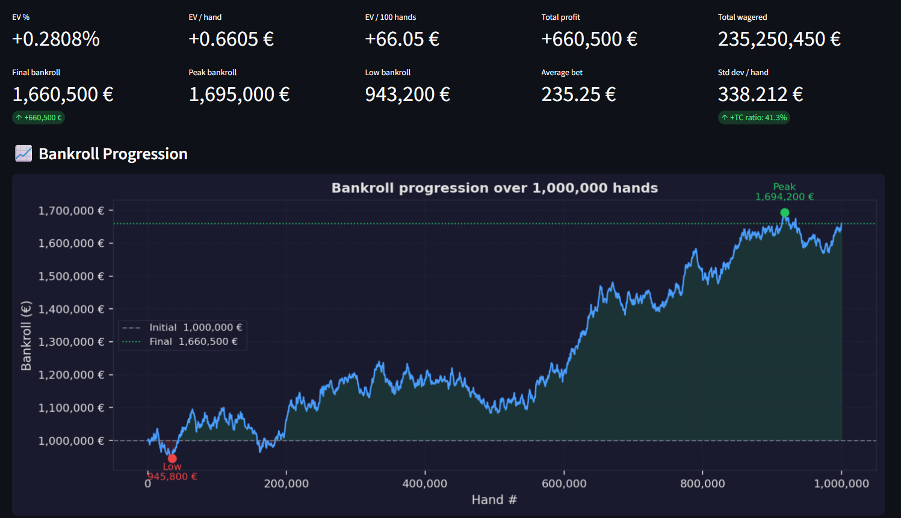

| Metric | Value | Interpretation |
|---|---|---|
| EV % | **+0.2808%** | Genuine positive edge over the casino |
| EV / hand | **+€0.66** | Average profit per hand |
| Total profit | **+€660,500** | Net gain over 1,000,000 hands |
| Average bet | **€235.25** | Effect of the bet spread - bets scale up at high TC |
| Final bankroll | **€1,660,500** | +66% on initial capital |
| Peak bankroll | **€1,695,000** | Highest point reached during the session |
| Low bankroll | **€943,200** | Maximum drawdown ≈ 5.7% from start |
| Std dev / hand | **€338.21** | Variance per hand at this bet spread |

The positive EV (+0.2808%) confirms that combining basic strategy with I18 deviations and a
bet spread generates a real mathematical edge against the house.

The bankroll chart shows the evolution over the full 1,000,000 hands. The session opens with
an early drawdown (Low: €943,200 - red marker) before recovering with a clear upward trend.
The green zone highlights all periods above the initial bankroll. Over one million hands,
the final bankroll (€1,660,500) sits 66% above the starting capital.

This illustrates a fundamental truth about card counting: **the edge is real but the variance
is significant**. Even with a positive EV, short-term losing streaks are normal and expected.
The simulator makes this concrete.

---

**True Count Analysis**

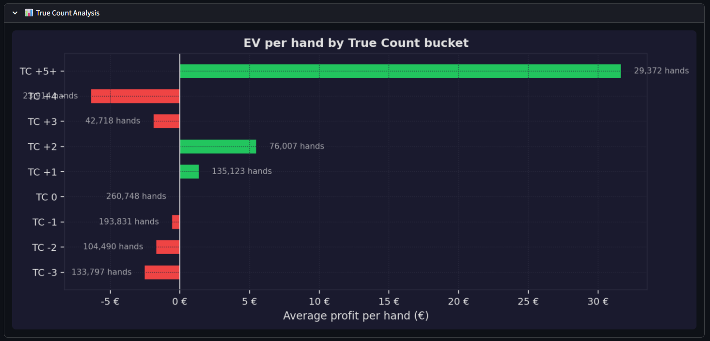

This chart shows the average profit per hand for each True Count bucket encountered during
the simulation. The result is the visual proof of *why card counting works*:

- **TC −3 and below** → strongly negative EV - the counter bets the table minimum
- **TC 0** → near-zero EV, close to neutral
- **TC +1 to +2** → EV turns positive - the counter starts increasing bets
- **TC +3 and above** → strongly positive EV - the counter bets the maximum

The player holds a mathematical edge precisely when they are betting the most.

---

**Hand Outcome Distribution**

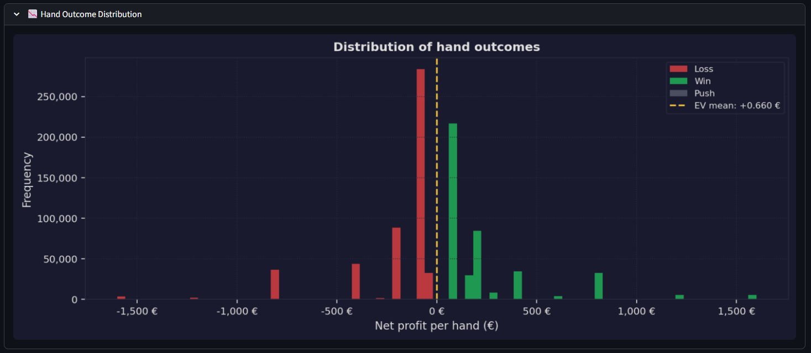

The histogram shows the distribution of net profit per hand across all 1,000,000 hands.

- The large central peak represents pushes and standard win/loss outcomes at unit size
- The distribution is slightly skewed right - consistent with a positive EV strategy
- The wide tails reflect the natural variance of blackjack: doubled hands, splits,
  and blackjacks produce large single-hand outcomes in both directions
- The yellow dashed line marks the EV mean (+€0.660)

---

**Variance Analysis - 5 Seeds**

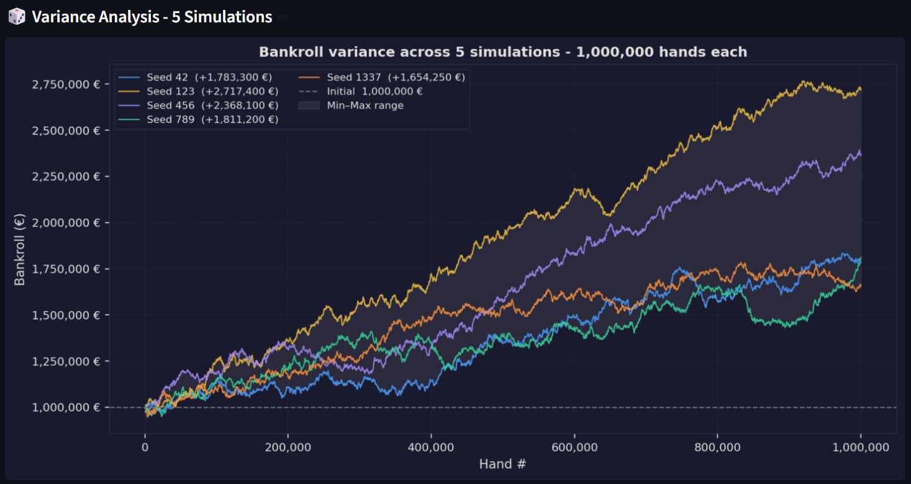

When **Run variance analysis** is enabled, the simulator runs 5 identical simulations with
different random seeds and overlays all 5 bankroll curves on a single chart.

| Seed | Net P&L |
|---|---|
| Seed 42 | +€1,783,300 |
| Seed 123 | +€2,717,400 |
| Seed 456 | +€2,368,100 |
| Seed 789 | +€1,011,200 |
| Seed 1337 | +€1,654,250 |

Key observations:

- **All 5 simulations are profitable** over 1,000,000 hands - the edge holds across every seed
- The spread between best (+€2.7M, Seed 123) and worst (+€1.0M, Seed 789) shows that variance
  remains substantial even over one million hands
- The grey shaded area covers the min-max range between the 5 curves at every point
- **Conclusion:** with a genuine edge and sufficient volume, profitability is consistent -
  but short-term results can vary dramatically, even across very long sessions

---

## EV Playground

### What is it?

The EV Playground simulates the exact Expected Value of every possible action (Hit, Stand,
Double, Surrender) for any specific hand situation at any True Count, using Monte Carlo with
a TC-biased shoe.

Unlike the Monte Carlo Simulator which models a full session, the EV Playground
**isolates a single decision** and measures its EV with statistical precision, including
95% confidence intervals.

**Use cases:**

- Verify whether a basic strategy play is optimal at a specific True Count
- Find the exact TC crossover point at which a deviation becomes mathematically correct
- Understand *why* the Illustrious 18 deviations exist - by seeing the numbers directly
- Explore edge cases not covered by the standard I18 list

---

### Example - Hard 10 (6+4) vs Dealer Queen at TC +5.0

**Configuration**

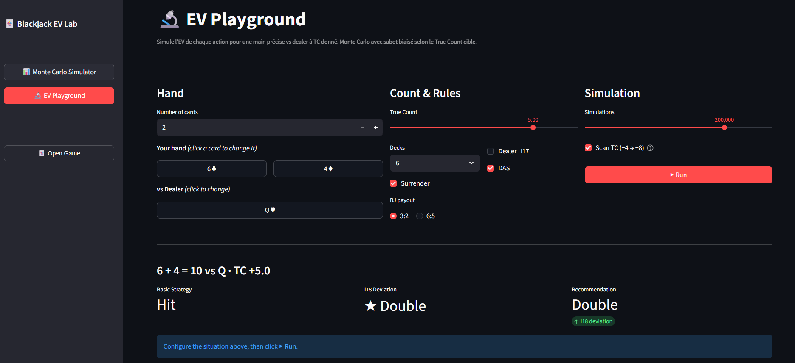

- **Hand:** 6♣ + 4♦ = Hard 10
- **Dealer up-card:** Q♥
- **True Count:** +5.0
- **Rules:** 6 decks · DAS · Surrender · 3:2
- **Simulations:** 200,000 per action
- **TC Scan:** enabled (range −4 → +8)

---

**Results**

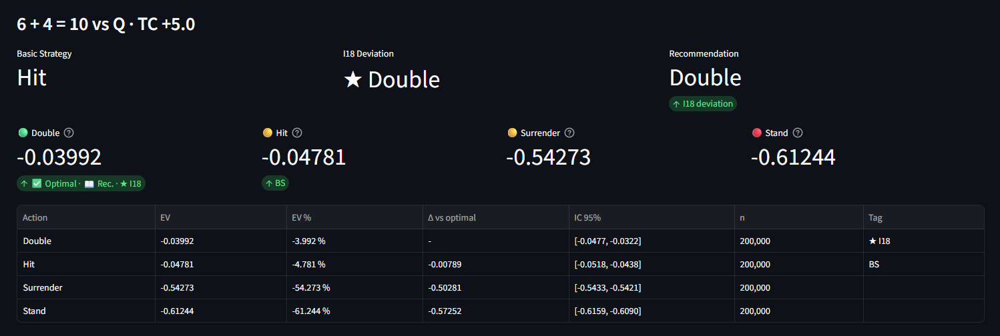

| | Recommendation |
|---|---|
| Basic Strategy | **Hit** |
| I18 Deviation | **★ Double** |
| Final recommendation | **Double** *(I18 deviation applies)* |

Detailed EV per action at TC +5.0:

| Action | EV | EV % | Δ vs optimal | Tag |
|---|---|---|---|---|
| Double | −0.03992 | −3.99% | - | ★ I18 - best |
| Hit | −0.04781 | −4.78% | −0.00789 | ✅ BS |
| Surrender | −0.54273 | −54.27% | −0.50281 | |
| Stand | −0.61244 | −61.24% | −0.57252 | |

At TC +5.0, the shoe is significantly rich in 10-value cards. Double is now clearly the best
action (-0.03992) ahead of Hit (-0.04781) - a gap of 0.00789 units that is statistically
robust at 200,000 simulations. The I18 deviation is confirmed: above the crossover point
(TC ≈ +3.26), doubling on Hard 10 vs Queen outperforms hitting.

---

**EV Bar Chart**

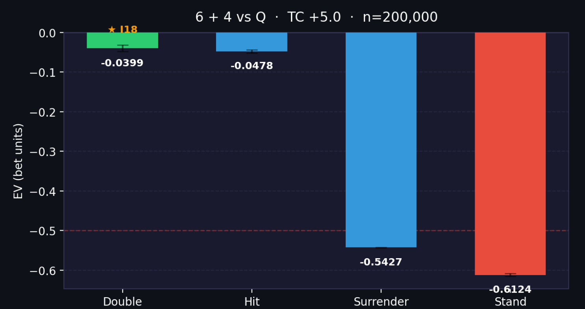

The bar chart visualizes the full action ranking at TC +5.0:

- **Double** (blue, labeled ★ I18) - best action, clearly ahead of Hit
- **Hit** (green) - second best, basic strategy default
- **Surrender** and **Stand** - far inferior, well below the −0.5 threshold
- The red dashed line at −0.5 marks the surrender threshold: any action worse than
  −0.5 loses more than surrendering half the bet

---

**TC Scan - EV vs True Count**

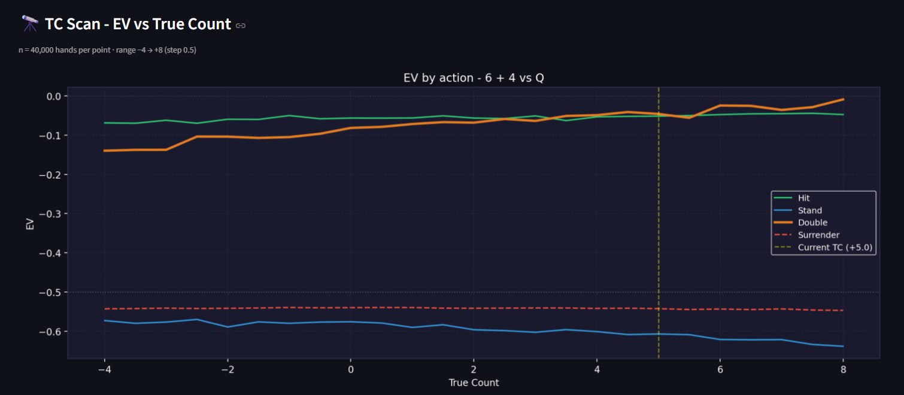

The TC Scan runs the simulation at every True Count from −4 to +8 (step 0.5, 40,000 hands per
point) to show how each action's EV evolves with the count.

Observations for Hard 10 vs Queen:

- **Hit** (green) is the best action at low TC values
- **Double** (orange) improves as TC rises and overtakes Hit around TC +3 to +3.5
- **Stand** (blue) is consistently the worst action at all TC values
- **Surrender** (red dashed) is a flat line at exactly −0.5 regardless of the count
- The vertical golden line marks the current TC (+5.0), well into Double territory

---

**Crossover Points (Index Plays)**

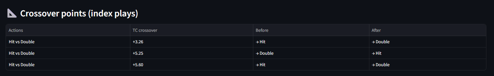

The tool automatically detects all TC values at which the optimal action switches:

| Matchup | TC Crossover | Before | After |
|---|---|---|---|
| Hit vs Double | +3.26 | → Hit | → Double |
| Hit vs Double | +5.25 | → Double | → Hit |
| Hit vs Double | +5.60 | → Hit | → Double |

The primary crossover at **TC +3.26** is the index play: above this threshold, doubling on
Hard 10 vs Queen produces a higher EV than hitting. The standard Illustrious 18 uses TC +4
as the practical threshold for this family of plays, which this simulation confirms is
conservative and correct.

---

*For a detailed breakdown of the architecture, strategy implementation, and game engine
internals - see [ARCHITECTURE.md](ARCHITECTURE.md).*

*Blackjack rules and terminology reference - see [docs/blackjack-reference.md](docs/blackjack-reference.md).*

---

*Built as a personal project to deepen understanding of blackjack mathematics, card counting
systems, and Monte Carlo simulation methods.*
